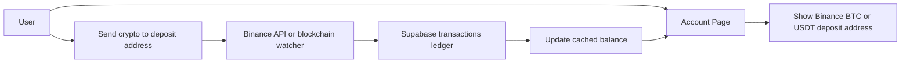

# Binance Deposit Flow Implementation

This document describes a simple, safe way to implement Binance-based deposits for SoundBridge.

## Goal

Users should send BTC or USDT to Binance deposit addresses shown in the app. When Binance or the blockchain confirms the deposit, the app should credit the user balance automatically in Supabase.

## Core Idea

The browser should never update balances directly for real money flows.

Instead:

1. The app shows a deposit address and QR code.
2. The user sends BTC or USDT to that address.
3. A backend process detects the incoming deposit.
4. The backend writes a confirmed transaction to Supabase.
5. The user balance is updated from the ledger and the UI refreshes.

## Recommended Simple Architecture

## Important Rule

For deposits, the address shown in the app must be a platform-controlled Binance destination address.

Do not:
- generate random addresses in the browser
- let the frontend mark deposits as completed
- update `total_earnings` from client-side code

## Suggested Data Model

Use a ledger-first model.

### `wallets`
Stores deposit destination addresses for each user and asset.

Example fields:
- `id`
- `user_id`
- `asset` (`btc` or `usdt`)
- `network` (`bitcoin` or `trc20`)
- `deposit_address`
- `qr_code_url` or `qr_payload`
- `is_active`
- `created_at`

### `transactions`
Stores all balance-changing events.

Example fields:
- `id`
- `user_id`
- `asset`
- `transaction_type` (`deposit`, `withdrawal`)
- `amount`
- `status` (`pending`, `confirmed`, `failed`)
- `tx_hash`
- `confirmations`
- `deposit_address`
- `description`
- `created_at`

### `balances`
Optional cached balance table.

Example fields:
- `user_id`
- `available_balance`
- `updated_at`

If you want the simplest possible version, you can skip `balances` and compute the balance from confirmed transactions.

## Deposit Flow

### 1. Create or assign deposit addresses

Assign each user a Binance deposit destination address for:
- BTC
- USDT TRC20

Best case: unique address per user per asset.

If Binance only gives you a shared address, you will need a second identifier, which is usually harder to maintain. Unique addresses are the simplest option.

### 2. Show the address in the account page

The account page should:
- display the BTC or USDT deposit address
- show a QR code
- show the required network
- explain that the user must send only the correct asset/network

### 3. Watch for incoming deposits

Use one of these options:
- Binance deposit history API, if it supports your account setup
- a blockchain watcher that monitors incoming transactions to the deposit address
- a backend job or Supabase Edge Function that polls for new deposits

For a simple implementation, polling is acceptable at first.

### 4. Confirm the deposit

Only credit the deposit when it is confirmed enough for your risk tolerance.

Store the blockchain transaction hash and use it as an idempotency key so the same deposit is never credited twice.

### 5. Credit the user in Supabase

When confirmed:
- insert a `transactions` row
- update the cached balance if you keep one
- notify the UI to refresh

## Withdrawal Flow

Withdrawals are separate from deposits.

For withdrawals:
1. The user requests a withdrawal in the app.
2. The backend checks the available balance.
3. The backend sends funds from your operational wallet or Binance withdrawal system to the user’s linked destination wallet.
4. The backend records the withdrawal in the ledger.

Do not let the browser send withdrawals directly.

## What Needs to Change in the Current App

The current account page logic is still mock-based.

The following behavior should be replaced:
- random wallet generation in the browser
- client-side updates to `total_earnings`
- deposit modal that acts like a fake payment form

The account page should instead:
- fetch deposit addresses from Supabase
- show the Binance BTC and USDT destination addresses
- read balance from confirmed ledger data
- refresh when the backend credits a deposit

## Supabase-Side Safety Notes

If you use Supabase for this flow:
- keep all deposit detection on the server
- never expose the service role key to the browser
- enable RLS on user-owned tables
- make sure users can only read their own deposit addresses and transactions

## Minimal Implementation Plan

### Phase 1
- Add `wallets` and `transactions` tables
- Store Binance deposit addresses per user and asset
- Update the account page to display those addresses

### Phase 2
- Add a backend watcher for BTC and USDT TRC20 deposits
- Detect confirmed incoming transfers
- Insert confirmed transactions into Supabase

### Phase 3
- Recompute or cache balances from the ledger
- Refresh the UI using polling or Supabase Realtime

### Phase 4
- Add withdrawal processing
- Validate balance before payout
- Send funds from the backend only

## Practical Recommendation

The simplest working version is:
- one deposit address per user per asset
- backend polling or webhook-based deposit detection
- transaction ledger as the source of truth
- balance updates driven by confirmed ledger rows

That gives you a clean path without making the frontend responsible for money movement.

## UI Behavior Example

Deposit button:
- opens a modal
- shows BTC or USDT destination address
- shows QR code
- shows a warning to send only the correct asset/network

Balance display:
- shows the confirmed available balance
- updates after the backend records a confirmed deposit

## Final Rule

Use the app to display deposit instructions.
Use the backend to detect payments.
Use Supabase to store the ledger and update balances.
